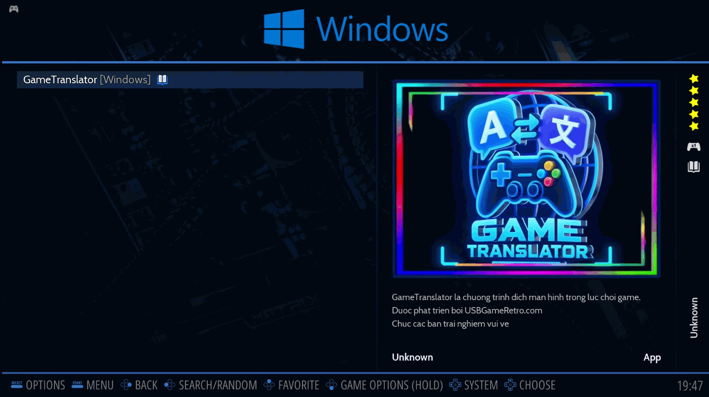
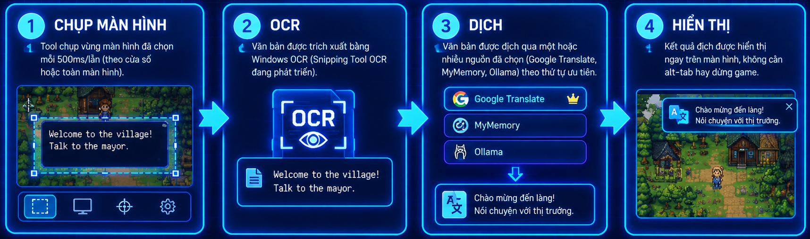
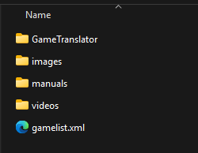
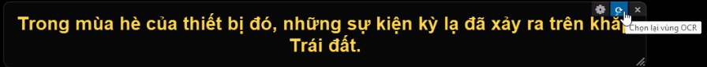
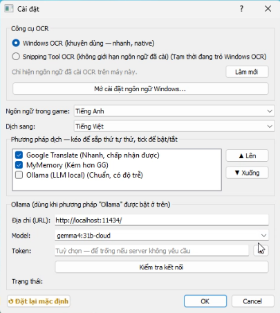

# GameTranslator

[](https://github.com/tranledienlam/game-translator-release/releases)
[](https://github.com/tranledienlam/game-translator-release)
[](https://github.com/tranledienlam/game-translator-release/releases)

Phát triển bởi [USBGameRetro.com](https://usbgameretro.com)

Công cụ dịch văn bản trong game theo thời gian thực — chụp vùng màn hình, nhận diện chữ bằng OCR, dịch tự động và hiển thị ngay trên màn hình. Thiết kế để chạy cùng RetroBat / các giả lập chạy ở chế độ windowed.



**📥 [Tải bản mới nhất tại đây](https://github.com/tranledienlam/game-translator-release/releases)**

---

## Mục lục

- [Ưu điểm](#ưu-điểm)
- [Nhược điểm / Giới hạn](#nhược-điểm--giới-hạn)
- [Danh sách giả lập hỗ trợ](#danh-sách-giả-lập-hỗ-trợ)
- [Cách hoạt động](#cách-hoạt-động)
- [Cài đặt](#cài-đặt)
- [Sử dụng](#sử-dụng)
- [Xử lý sự cố thường gặp](#xử-lý-sự-cố-thường-gặp)
- [Changelog](#changelog)
- [Nhà phát triển & Ủng hộ](#nhà-phát-triển--ủng-hộ)

---

## Ưu điểm

- Dịch trực tiếp trong lúc chơi, không cần alt-tab hay dừng game
- Hỗ trợ nhiều phương pháp dịch (Google Translate, MyMemory, Ollama), có thể chọn nhiều nguồn và sắp xếp thứ tự ưu tiên
- Tự động khởi động cùng RetroBat thông qua Task Scheduler — không cần thao tác thủ công phức tạp
- Vùng chọn OCR dễ điều chỉnh ngay trên thanh công cụ của hộp dịch
- Ollama cho phép dịch offline hoàn toàn (không cần internet)

## Nhược điểm / Giới hạn

- **Chỉ hoạt động trên Windows**, và chỉ với game/giả lập chạy ở chế độ **windowed** (kể cả full màn hình giả lập kiểu RetroBat)
- **Không hoạt động** với giả lập chạy full màn hình thật sự (danh sách bên dưới)
- Độ chính xác OCR phụ thuộc nhiều vào **phông chữ và kích cỡ chữ** trong game — chữ càng rõ, càng nhỏ gọn, độ chính xác càng cao
- Đang dùng **Windows OCR**, chưa chuẩn bằng Snipping Tool OCR (dự kiến cải thiện ở bản cập nhật sau)
- Chất lượng dịch tùy phương pháp:
  - **Google Translate**: khá chính xác, nhưng thỉnh thoảng lỗi/giới hạn request
  - **MyMemory**: ổn định, nhưng chất lượng dịch thấp hơn
  - **Ollama**: phụ thuộc cấu hình máy (nếu chạy model local) hoặc model cloud đang dùng
- Dịch tiếng Nhật cần cài thêm gói ngôn ngữ Nhật trên Windows

## Danh sách giả lập hỗ trợ

### ✅ Hoạt động được (chạy windowed, kể cả khi RetroBat hiển thị full màn hình)

```
retroarch, flycast, redream, fbneo64, Mesen, mGBA, mednafen,
jgenesis-cli, NO$GBA, dolphin, raine, azahar, mandarine-qt,
citra-qt, citra, RMG, simple64, Project64, melonDS, DeSmuME,
OpenBOR, duckstation-qt, pcsx2-qt, pcsx2, Play, rpcs3, shadPS4,
ppssppwindows, yabasanshiro, kronos, ymir, SSF, snes9x
```

### ❌ Không hoạt động (chạy full màn hình thật, không phải windowed giả lập)

```
pce, mame, Fusion, demul, ares, EmuHawk
```

> **Cách nhận biết:** nếu mở game mà hộp dịch không hiển thị bên trên cửa sổ game, khả năng cao giả lập đó đang chạy ở chế độ full màn hình thật — không dùng được với tool.

## Cách hoạt động



1. Tool chụp vùng màn hình đã chọn mỗi **500ms/lần** (chụp theo cửa sổ hoặc toàn màn hình)
2. Văn bản được trích xuất bằng **Windows OCR** *(phương pháp Snipping Tool OCR đang phát triển, chưa hoàn thiện)*
3. Văn bản được dịch qua một hoặc nhiều nguồn đã chọn (Google Translate, MyMemory, Ollama) theo thứ tự ưu tiên
4. Kết quả hiển thị trong hộp dịch nổi trên màn hình

> **Lưu ý về chớp hộp dịch:** nếu thấy hộp dịch bị chớp liên tục, đó là do tool đang chụp ở chế độ toàn màn hình (chụp luôn cả chính hộp dịch). Cách khắc phục: chọn vùng chụp nhỏ hơn, hoặc kéo hộp dịch ra khỏi vùng chụp (ví dụ dời sang màn hình thứ 2).

## Cài đặt

1. Vào [trang Releases](https://github.com/tranledienlam/game-translator-release/releases), tải bản mới nhất (`GameTranslator_v{version}.zip`) và giải nén
2. Trong thư mục `tool` giải nén sẽ có cấu trúc:

   | Thư mục/File | Mô tả |
   |---|---|
   | `images`, `videos`, `manuals`, `gamelist.xml` | Media của RetroBat |
   | `GameTranslator/` | Chương trình dịch |

3. Copy toàn bộ nội dung vào thư mục `roms/windows/` của RetroBat



> **Vì sao cần Task Scheduler?** RetroBat quản lý các giả lập theo một tiến trình chung, nên không thể khởi động trực tiếp tool từ menu RetroBat như một game bình thường. Tool đã tự xử lý việc này bằng cách đăng ký chạy qua Task Scheduler — bạn không cần cấu hình gì thêm, chỉ cần mở tool như hướng dẫn bên dưới.

## Sử dụng

**Cách 1 — Từ RetroBat:**
Mở RetroBat → vào mục **Windows** → khởi động **GameTranslator** trước khi chọn game để chơi.

**Cách 2 — Trực tiếp:**
Click đúp vào `GameTranslator.exe`.



- Chọn vùng màn hình cần OCR ngay trên thanh công cụ của hộp dịch
- Vào phần **Settings** để:
  - Chọn/sắp xếp thứ tự ưu tiên các phương pháp dịch
  - Test độ phản hồi (tốc độ dịch) của từng phương pháp



## Xử lý sự cố thường gặp

| Vấn đề | Nguyên nhân | Cách khắc phục |
|---|---|---|
| Hộp dịch không hiển thị khi mở game | Giả lập đang chạy full màn hình thật | Kiểm tra danh sách giả lập không hỗ trợ ở trên |
| Hộp dịch bị chớp liên tục | Đang chụp toàn màn hình, dính cả hộp dịch | Thu nhỏ vùng chụp hoặc dời hộp dịch ra ngoài vùng chụp |
| OCR nhận sai/không nhận được chữ | Font chữ trong game khó đọc, hoặc chữ quá nhỏ | Thử tăng scale hiển thị hoặc dùng shader làm chữ rõ hơn |
| Không nhận diện được tiếng Nhật | Thiếu gói ngôn ngữ Windows | Cài thêm tiếng Nhật tại Settings → Time & Language → Language |
| Dịch chậm | Tùy phương pháp đang chọn | Vào Settings test độ phản hồi, đổi thứ tự ưu tiên hoặc đổi engine |

## Changelog

Xem chi tiết các bản cập nhật tại [`CHANGELOG.md`](./CHANGELOG.md).

## Nhà phát triển

Phát triển và bảo trì bởi **[USBGameRetro.com](https://usbgameretro.com)**.

Cảm ơn các bạn đã ủng hộ! 🙏